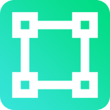

<p align="center">
    
</p>

# Nuxt mdi

[![npm version][npm-version-src]][npm-version-href]
[![npm downloads][npm-downloads-src]][npm-downloads-href]
[![License][license-src]][license-href]
[![Nuxt][nuxt-src]][nuxt-href]

Add 7,000+ icons to your Nuxt project, from [Material Design Icons](https://pictogrammers.com/library/mdi/).

- [✨&nbsp;Release Notes](/CHANGELOG.md)
- [🏀&nbsp;Online playground](https://stackblitz.com/github/ERPedersen/nuxt-mdi?file=playground%2Fapp.vue)
- [📖 &nbsp;Documentation](https://nuxt-mdi.emilrosenius.com)

## Features

- Add 7,000+ icons, from [Material Design Icons](https://pictogrammers.com/library/mdi/).
- TypeScript completion.
- Zero imports needed.

## Getting Started

### Installation

Install the `nuxt-mdi` dependency to your project using your preferred package manager:

```bash
pnpm add -D nuxt-mdi
```
```bash
yarn add --dev nuxt-mdi
```
```bash
npm install --save-dev nuxt-mdi
```

### Activation

Add `'nuxt-mdi'` to the `modules` section of your `nuxt.config.ts` file.

```ts
export default defineNuxtConfig({
  modules: [
    'nuxt-mdi'
  ]
})
```

That's it! You can now use nuxt-mdi in your Nuxt app ✨

## Usage

The module will automatically make the `MdiIcon` component available to your app. You can use it like this:

```html
<MdiIcon icon="mdiAccount" />
```

### Props:

- `icon` (required): The name of the icon to display.
- `flipX` (optional): Flip the icon on the X axis.
- `flipY` (optional): Flip the icon on the Y axis.

## Configuration

You can configure this module by adding an `mdi` section to the `nuxt.config.ts` file.

```ts
export default defineNuxtConfig({
  // ...
  mdi: {
    cache: false,
    componentName: 'MdiIcon',
    defaultSize: '1em'
  }
})
```

### Cache: `cache`

Once an icon is loaded, it is automatically cached in localStorage. This means that the icon will be loaded from localStorage instead of the network on subsequent requests. This is enabled by default, but can be disabled by setting `cache` to `false`.

### Component name: `componentName`

By default, the component name is `MdiIcon`. You can change this by setting the `componentName` option.

```ts
export default defineNuxtConfig({
  // ...
  mdi: {
    componentName: 'MyIcon'
  }
})
```

```vue
<MyIcon icon="mdiAccount" />
```

### Default size: `defaultSize`

By default, the icons will be rendered at `1em`. You can change this by setting the `defaultSize` option.

## Icons
You can find available icons on the [Material Design Icons website](https://pictogrammers.com/library/mdi/). IntelliSense will automatically display auto completion for the available icons. 
 
If you are using VS Code, you can use the [Vue Language Features (Volar)](https://marketplace.visualstudio.com/items?itemName=Vue.volar) extension to get IntelliSense for Vue components.

<!-- Badges -->
[npm-version-src]: https://img.shields.io/npm/v/nuxt-mdi/latest.svg?style=flat&colorA=18181B&colorB=28CF8D
[npm-version-href]: https://npmjs.com/package/nuxt-mdi

[npm-downloads-src]: https://img.shields.io/npm/dm/nuxt-mdi.svg?style=flat&colorA=18181B&colorB=28CF8D
[npm-downloads-href]: https://npmjs.com/package/nuxt-mdi

[license-src]: https://img.shields.io/npm/l/nuxt-mdi.svg?style=flat&colorA=18181B&colorB=28CF8D
[license-href]: https://npmjs.com/package/nuxt-mdi

[nuxt-src]: https://img.shields.io/badge/Nuxt-18181B?logo=nuxt.js
[nuxt-href]: https://nuxt.com
